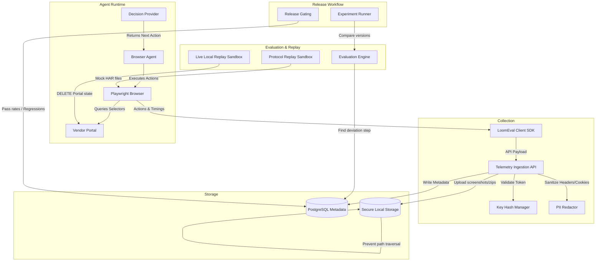

# LoomEval: Technical Architecture

This document describes the technical layout, ingestion pipelines, replay modes, data isolation boundaries, and security architecture of the LoomEval platform.

---

## 1. System Layout & Architecture Overview

LoomEval is implemented as a unified **Next.js App Router Monolith** powered by TypeScript, Tailwind CSS, Prisma, and PostgreSQL (with an optional SQLite database fallback for local-first testing).

---

## 2. Telemetry Ingestion Pipeline & Security

The ingestion boundary is implemented inside the [Ingestion API Route](../src/app/api/v1/traces/route.ts). It enforces strict verification checks before writing logs:

### A. Ingestion Key Hashing
*   **Security Standard**: Plaintext ingestion keys (e.g. `le_ingest_<token>`) are never stored in the database.
*   **Verification**: The server parses the key prefix, matches the record, computes the SHA-256 hash of the bearer token, and compares it against the database's `hashedKey` record.
*   **Source Reference**: Logic is located in the [KeyManager Class](../src/core/security/keys.ts).

### B. Size Restrictions
*   **Payload Ceiling**: Enforces a strict 10MB payload limit check inside header content-lengths and text body bytes.
*   **Status Codes**: Returns `HTTP 413 Payload Too Large` immediately if limits are breached.

### C. Server-Side PII Redaction
*   **PII Sanitization**: Scrubbing filters scan action inputs and HTTP headers. 
*   **Headers Scrubbed**: Replaces sensitive authentication fields (e.g. `Authorization`, `Cookie`, `Set-Cookie`) with `[REDACTED]` placeholders before database persistence.
*   **Source Reference**: Managed by the [Redactor Class](../src/core/security/redactor.ts).

---

## 3. Storage Separation & Traversal Guards

LoomEval strictly separates metadata and structural timelines from heavy binary files:

1.  **PostgreSQL / SQLite Database**: Stores trace status, action types, network metadata (excluding payload bodies if skipped), timestamps, latencies, and experiment results.
2.  **Local Artifact Store**: Captures page screenshots and Playwright trace ZIP archives.
    *   **Traversal Prevention**: Validates incoming filenames (`input.name`) and resolves absolute paths against a base directory outside Next.js publicly served routes. Attempts to traverse directories throw an `Access denied` error immediately.
    *   **Integrity Hash**: Computes SHA-256 digests of binary buffers to detect data corruption or duplication.
    *   **Source Reference**: Managed by the [LocalArtifactStore Class](../src/core/artifacts/store.ts).

---

## 4. Replay Sandbox Modes

LoomEval supports three honest replay modes inside [sandbox.ts](../src/core/replay/sandbox.ts):

1.  **Forensic Replay**: Loads and returns static timeline evidence (screenshots, DOM structures, console errors) without executing headless browsers.
2.  **Protocol Replay**: Intercepts Playwright page network traffic using `page.route('**/*', (route) => { ... })`. It blocks production domains and unmatched endpoints by default, serving mocked responses from the database HAR logs matching Method, canonical URL, and Request Body.
3.  **Live Local Replay**: Invokes the vendor portal's DELETE endpoint to reset state, starts Playwright, re-executes the agent, creates a new trace, and compares it side-by-side with the source trace to identify UI/action deviations.
